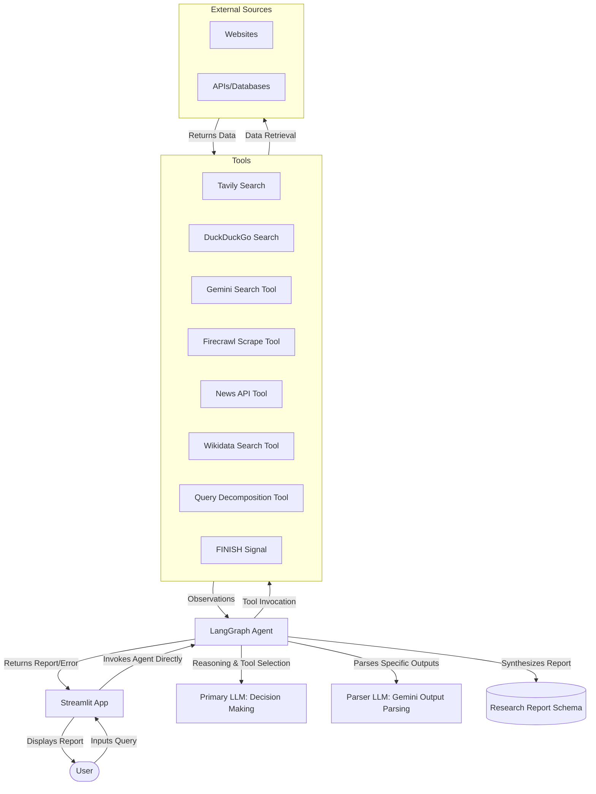

# Faraday Web Research Agent 🕵️‍♀️


[](https://www.python.org/downloads/)
[](https://streamlit.io/)
[](https://www.langchain.com/)
[](https://opensource.org/licenses/MIT)

## ✨ Overview

Faraday is a comprehensive web research agent designed to investigate queries by **autonomously gathering and analyzing information** from multiple online sources. It uses a sophisticated agent powered by LLMs and LangGraph to dynamically select tools, conduct research, and synthesize findings, ultimately delivering a structured research report directly within a Streamlit interface.

## 🚀 Features

- **🤖 Agentic Workflow**: Employs an AI agent orchestrated with LangGraph to manage the entire research process directly within Streamlit.
- **🛠️ Dynamic Tool Selection**: The agent intelligently chooses the best tools (Search Engines, Web Scrapers, APIs) based on the query and intermediate findings.
- **🔍 Multi-source Evidence Collection**: Gathers information from diverse sources using tools like Tavily, Google Search (via Gemini), DuckDuckGo, Wikidata, NewsAPI, and Firecrawl.
- **🧩 Query Decomposition**: Can break down complex queries into simpler, searchable sub-questions using LLMs.
- **📝 Structured Reporting**: Synthesizes findings into a well-organized report with a summary, detailed sections, and source attribution.
- **🔗 Source Attribution**: Transparently lists all sources consulted and the tools used to access them.
- **🖥️ Modern Dark Mode Interface**: Clean, user-friendly Streamlit interface for interaction and result presentation.

## 🏗️ System Architecture

Faraday leverages an **agentic architecture**, orchestrated using LangGraph, running directly within the Streamlit application. Instead of a fixed pipeline, a central **Web Research Agent** dynamically plans and executes tasks using a suite of available tools:



*This diagram represents a high-level overview of the simplified system components and their interactions, driven by the agent's dynamic workflow within Streamlit.*

## ⚙️ How the System Works (Agentic Flow)

The web research process is driven by the agent's autonomous reasoning within the LangGraph framework, executed within the Streamlit app:

1.  **User Input**: A user submits a research query via the Streamlit UI (`app.py`).
2.  **Agent Execution**: The Streamlit app directly invokes the LangGraph agent (`run_web_research`) with the query:
    *   The agent analyzes the query and decides the next best action (e.g., decompose query, search the web, scrape a page).
    *   It invokes the appropriate tool with specific inputs.
    *   It processes the tool's observation (output) and updates its internal state.
    *   This cycle continues (Agent -> Tool -> Agent) until the agent determines it has gathered sufficient information.
3.  **Final Synthesis**: Once the agent decides to finish, it synthesizes all gathered information and structured observations into a `ResearchReport` or `ErrorResponse` object.
4.  **Presentation**: The final report or error message is returned to the Streamlit app and presented directly to the user in the UI.

## 🚀 Getting Started

### Prerequisites

- Python 3.8+
- Required API keys stored securely (e.g., in a `.env` file) for the tools you intend to use (e.g., OpenAI, Google AI, Tavily, NewsAPI, Firecrawl).

### Installation

1.  Clone the repository:
    ```bash
    git clone <repository_url>
    cd <repository_directory>
    ```
2.  Install dependencies:
    ```bash
    pip install -r requirements.txt
    ```
3.  Set up environment variables by creating a `.env` file in the root directory with your API keys.

### Running the Application

1.  Start the Streamlit application:
    ```bash
    streamlit run app.py
    ```
    The app will usually be available at `http://localhost:8501`.

## 🤔 Example Queries to Try

Challenge the agent with various research queries:

- "What are the latest advancements in renewable energy technology?"
- "Explain the concept of large language models and their applications."
- "Compare and contrast the economic impacts of Brexit on the UK and the EU."
- "Provide a brief history of the internet."

## 🔌 API Usage

(The separate API endpoint is no longer applicable as the logic is integrated into the Streamlit app.)

## 🤝 Contributing

Contributions are welcome! If you have suggestions, bug reports, or want to add new tools or features, please feel free to:

1.  Open an issue to discuss the change.
2.  Fork the repository.
3.  Create a new branch (`git checkout -b feature/YourFeature`).
4.  Make your changes.
5.  Commit your changes (`git commit -m 'Add some feature'`).
6.  Push to the branch (`git push origin feature/YourFeature`).
7.  Open a Pull Request.

## 📜 License

This project is licensed under the MIT License - see the `LICENSE` file for details.

## 🙏 Acknowledgments

- Built with ❤️ using [Python](https://www.python.org/), [Streamlit](https://streamlit.io/), and [LangChain/LangGraph](https://www.langchain.com/).
- Leverages powerful APIs and tools from [Tavily AI](https://tavily.com/), [Google AI (Gemini)](https://ai.google.dev/), [DuckDuckGo](https://duckduckgo.com/), [Firecrawl](https://firecrawl.dev/), [NewsAPI](https://newsapi.org/), [Wikidata](https://www.wikidata.org/), and others.
- Inspired by the need for effective and automated information gathering. 
